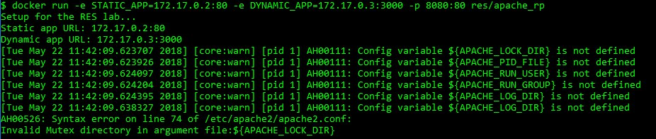
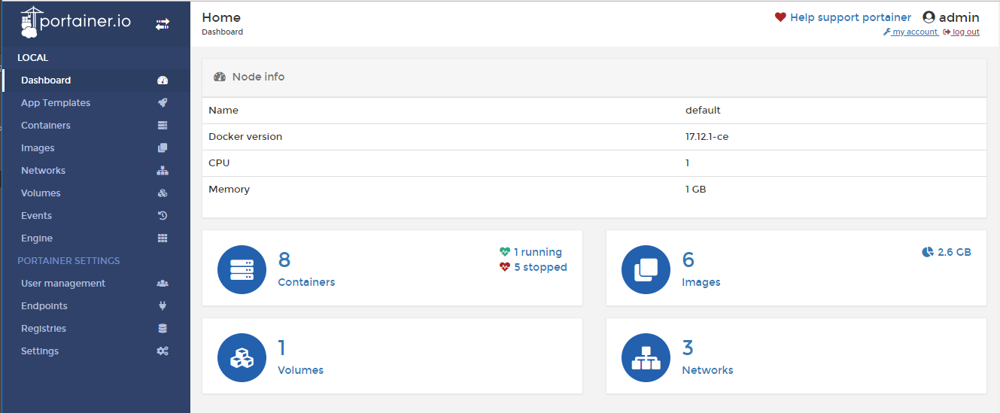

# RES-2018-HTTPInfra

## Introduction

This is the result of the last lab in the course RES 2018 at HEIG-VD. The mains objectives of this lab is to configure a complete web infrastructure and implement a simple dynamic web application.


## Step 1: Static HTTP server with apache httpd

### Configuration

In that first step, we have created a Dockerfile to create a apache-php web server and added a simple website into it. 

Dockerfile :

```dockerfile
#get official the server image on the web
FROM php:5.6-apache 

#copy the content of the "content/" folder in the default web folder of the server. The content of this folder will be sent to the browser
COPY content/ /var/www/html/ 
```

Docker commands to run it :

```powershell
cd docker-images/apache-php-image/
docker build -t res/apache_php .
docker run -p 9090:80 res/apache_php
```

A test website is already in the "content/" folder : [https://startbootstrap.com/template-overviews/agency/](https://startbootstrap.com/template-overviews/agency/)


### Acceptance criteria

- You have a GitHub repo with everything needed to build the Docker image. ✔
- You do a demo, where you build the image, run a container and access content from a browser. ✔
- You have used a nice looking web template, different from the one shown in the webcast. ✔
- You are able to explain what you do in the Dockerfile. ✔
- You are able to show where the apache config files are located (in a running container). ✔
- You have documented your configuration in your report. ✔


## Step 2: Dynamic HTTP server with express.js

### Configuration

In that second step we have created a dynamic HTTP server with express.js. 

Dockerfile :

```dockerfile
#specify the nodejs version
FROM node:4.4

#copy the folder src in the docker image
COPY src /opt/app

#change the working directory (cd..)
WORKDIR /opt/app/

#install dependencies
RUN npm install

#start the nodejs server
CMD ["node", "/opt/app/index.js"]
```

Docker commands to run it :

```powershell
cd docker-images/express-image/

#create the docker image
docker build -t res/express_locations .
```

Acces into docker machine

```dockerfile
#start the image
docker run res/express_locations

#into another docker terminal, to go into the docker machine
docker-machine ssh

#to get the image id
docker ps

#to get the IP address of the image running
docker inspect [ID]

#to connect to the server
telnet [IP] 3000
```

Acces into our environment 

```dockerfile
#start the image
docker run -p 9090:3000 res/express_students

#just go into Postman or our browser

#OPTIONAL - interfactive...
docker run -it res/express_locations /bin/bash
```


### Acceptance criteria

- You have a GitHub repo with everything needed to build the Docker image. ✔

- You do a demo, where you build the image, run a container and access content from a browser. ✔

- You generate dynamic, random content and return a JSON payload to the client. ✔

- You cannot return the same content as the webcast (you cannot return a list of people). ✔

- You don't have to use express.js; if you want, you can use another JavaScript web framework or event another language. ✔

- You have documented your configuration in your report. ✔

  ​

## Step 3: Reverse proxy with apache (static configuration)

### Configuration

Reload docker images from step 1 and 2 (kill all current running images)

```dockerfile
#run docker images
docker run -d --name apache_static res/apache_php
docker run -d --name express_dynamic res/express_locations 

#get images IPs
docker inspect apache_static | grep -i ipaddress -> 172.17.0.2
docker inspect express_dynamic | grep -i ipaddress -> 172.17.0.3

```

To create the conf files for apache in the folder /etc/apache2/sites-available/

000-default.conf

```xml
<VirtualHost *:80>
</VirtualHost>
```

001-reverse-proxy.conf

```xml
<VirtualHost *:80>
	#specify a servername
    ServerName demo.res.ch
    
    #specify the proxy for the location api
    ProxyPass "/api/locations/" "http://172.17.0.3:3000/"
    ProxyPassReverse "/api/locations/" "http://172.17.0.3:3000/"
    
    #specify the proxy for the web server
    ProxyPass "/" "http://172.17.0.2:80/"
    ProxyPassReverse "/" "http://172.17.0.2:80/" 
</VirtualHost>
```

How to test it in local first 

```powershell
 docker-machine ssh
 telnet 172.17.0.3 3000
 GET / HTTP/1.0
```

After that, let's start the proxy with that dockerfile

```dockerfile
#specify apache version
FROM php:5.6-apache

COPY conf/ /etc/apache2/

#enable modules and sites configurations that we've created in the "conf/" folder
RUN a2enmod proxy proxy_http
RUN a2ensite 000-* 001-*
```

Docker commands 

```dockerfile
docker build -t res/apache_rp .
docker run -p 8080:80 res/apache_rp
docker run -d -p 8080:80 --name apache_rp res/apache_rp
```

If you're on local, update your hosts file to redirect demo.res.ch to your docker ip

You can now acces to 

http://demo.res.ch:8080 and http://demo.res.ch:8080/api/locations


### Acceptance criteria

- You have a GitHub repo with everything needed to build the Docker image for the container. ✔

- You do a demo, where you start from an "empty" Docker environment (no container running) and where you start 3 containers: static server, dynamic server and reverse proxy; in the demo, you prove that the routing is done correctly by the reverse proxy. ✔

- You can explain and prove that the static and dynamic servers cannot be reached directly (reverse proxy is a single entry point in the infra). ✔

- You are able to explain why the static configuration is fragile and needs to be improved. ✔

- You have documented your configuration in your report. ✔

  ​

## Step 4: AJAX requests with JQuery

### Configuration

All dockerfiles updated to install VI

```dockerfile
RUN apt-get update && \
 apt-get install -y vim
```

Now we can reload docker images and containers.

Update apache-php-image/content/index.php to add a script html balise

```html
<!-- Custom script to load locations -->
<script src="js/locations.js"></script>
```

And now we can create the script in apache-php-image/content/js/locations.js

```javascript
$(function() {
    console.log("Loading locations");
    
    //asynchornous ajax request to get location without reload the page
    function loadLocations(){
        $.getJSON("/api/locations/", function(locations){
            console.log(locations);
            var message = "No location !";
            if(locations.length > 0){
                message = locations[0].city + " " + locations[0].city;
            }
            $("#location").text(message);
        });
    };
    
    loadLocations();
    
    //call loadLocations function each seconds
    setInterval(loadLocations, 1000);
});
```


### Acceptance criteria

- You have a GitHub repo with everything needed to build the various images. ✔

- You do a complete, end-to-end demonstration: the web page is dynamically updated every few seconds (with the data coming from the dynamic backend). ✔

- You are able to prove that AJAX requests are sent by the browser and you can show the content of th responses. ✔

- You are able to explain why your demo would not work without a reverse proxy (because of a security restriction). ✔

- You have documented your configuration in your report. ✔

  ​

## Step 5: Dynamic reverse proxy configuration

### Configuration

In this part, I've tried to copy the apache2-foreground in the YouTuve vidéo but I had the following error : 



I've decided to get the new apacher2-foreground from the official docker-images GitHub : https://github.com/docker-library/php/blob/master/5.6/jessie/apache/apache2-foreground

The bug is resolved with that manipulation.

After that, I've created the following PHP template to replace the static IPs with the IPs specified when start the docker image :

config-template.php

```php
<?php 
    $STATIC_APP = getenv('STATIC_APP');
    $DYNAMIC_APP = getenv('DYNAMIC_APP');
?>

<VirtualHost *:80>
    ServerName demo.res.ch
    
    ProxyPass '/api/locations/' 'http://<?php print "$DYNAMIC_APP" ?>/'
    ProxyPassReverse '/api/locations/' 'http://<?php print "$DYNAMIC_APP" ?>/'
    
    ProxyPass '/' 'http://<?php print "$STATIC_APP" ?>/'
    ProxyPassReverse '/' 'http://<?php print "$STATIC_APP" ?>/' 
</VirtualHost>
```

He overwrite 001-reverse-proxy.conf with the IPs specified on the docker run command :

```powershell
php /var/apache2/templates/config-template.php > /etc/apache2/sites-available/001-reverse-proxy.conf
```

Docker run command : 

```powershell
docker run -e STATIC_APP=172.17.0.2:80 DYNAMIC_APP=172.17.0.3:3000 -p 8080:80 res/apache_rp
```


### Acceptance criteria

- You have a GitHub repo with everything needed to build the various images. ✔

- You have found a way to replace the static configuration of the reverse proxy (hard-coded IP adresses) with a dynamic configuration. ✔

- You may use the approach presented in the webcast (environment variables and PHP script executed when the reverse proxy container is started), or you may use another approach. The requirement is that you should not have to rebuild the reverse proxy Docker image when the IP addresses of the servers change. ✔

- You are able to do an end-to-end demo with a well-prepared scenario. Make sure that you can demonstrate that everything works fine when the IP addresses change! ✔

- You are able to explain how you have implemented the solution and walk us through the configuration and the code. ✔

- You have documented your configuration in your report. ✔

  ​

## Load balancing: multiple server nodes

### Configuration

Source : https://httpd.apache.org/docs/2.4/fr/mod/mod_proxy_balancer.html

To configure the multiple server nodes, we have to update the config-template.php

```php
<?php
  $dynamic_app1 = getenv('DYNAMIC_APP1');
  $dynamic_app2 = getenv('DYNAMIC_APP2');
  $static_app1 = getenv('STATIC_APP1');
  $static_app2 = getenv('STATIC_APP2');
?>

<VirtualHost *:80>
    ServerName demo.res.ch
    
    <Proxy "balancer://locationsset">
        BalancerMember 'http://<?php print "$dynamic_app1"?>'
        BalancerMember 'http://<?php print "$dynamic_app2" ?>'
    </Proxy>
    
    <Proxy "balancer://webserverset">
        BalancerMember 'http://<?php print "$static_app1" ?>/'
        BalancerMember 'http://<?php print "$static_app2" ?>/'
    </Proxy>
    
    ProxyPass '/api/locations/' 'balancer://locationsset/'
    ProxyPassReverse '/api/locations/' 'balancer://locationsset/'
    
    ProxyPass '/' 'balancer://webserverset/'
    ProxyPassReverse '/' 'balancer://webserverset/' 
</VirtualHost>
```

finally, we can add the following line to the dockerfile to activate de module

`` RUN a2enmod proxy_balancer status lbmethod_byrequests`` 

To check the load balancing I tryed to kill docker container and check if the application works correctly with one or the other image running.

### Acceptance criteria

- You extend the reverse proxy configuration to support **load balancing**. ✔
- You show that you can have **multiple static server nodes** and **multiple dynamic server nodes**. ✔
- You prove that the **load balancer** can distribute HTTP requests between these nodes. ✔
- You have documented your configuration and your validation procedure in your report. ✔


## Management UI

### Configuration

Created a script for portainer.io 

```powershell
docker volume create portainer_data
docker run -d -p 9000:9000 -v /var/run/docker.sock:/var/run/docker.sock -v portainer_data:/data portainer/portainer
```

This script will run a docker image with the portainer app to manage docker with a web management UI.

To acces to this app, run this script and acces to http://192.168.99.100:9000/#/dashboard



With this app you can do a lot of thing with Docker with a simple interface

### Acceptance criteria

- You develop a web app (e.g. with express.js) that administrators can use to monitor and update your web infrastructure. (✔) -> https://portainer.io/
- You find a way to control your Docker environment (list containers, start/stop containers, etc.) from the web app. For instance, you use the Dockerode npm module (or another Docker client library, in any of the supported languages). ✔
- You have documented your configuration and your validation procedure in your report. ✔


## Some useful Docker commands

Source : https://techoverflow.net/2013/10/22/docker-remove-all-images-and-containers/

```powershell
#!/bin/bash
# Kill all containers
docker kill $(docker ps -qa)
# Delete all containers
docker rm $(docker ps -a -q)
# Delete all images
docker rmi $(docker images -q)
```

